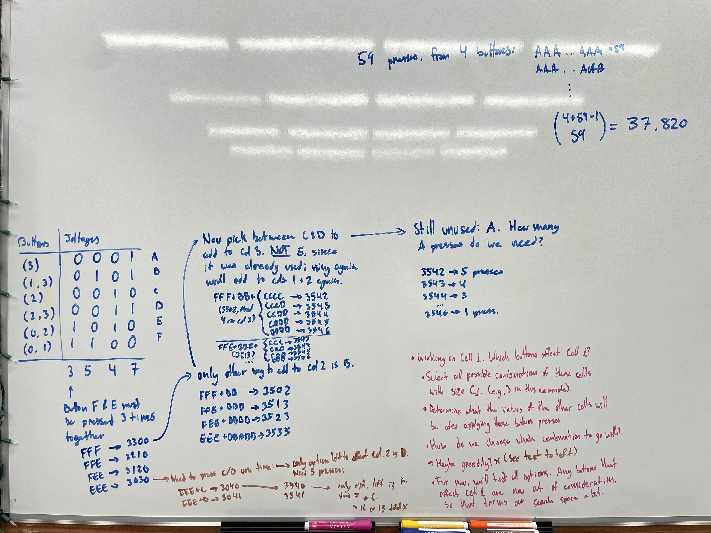
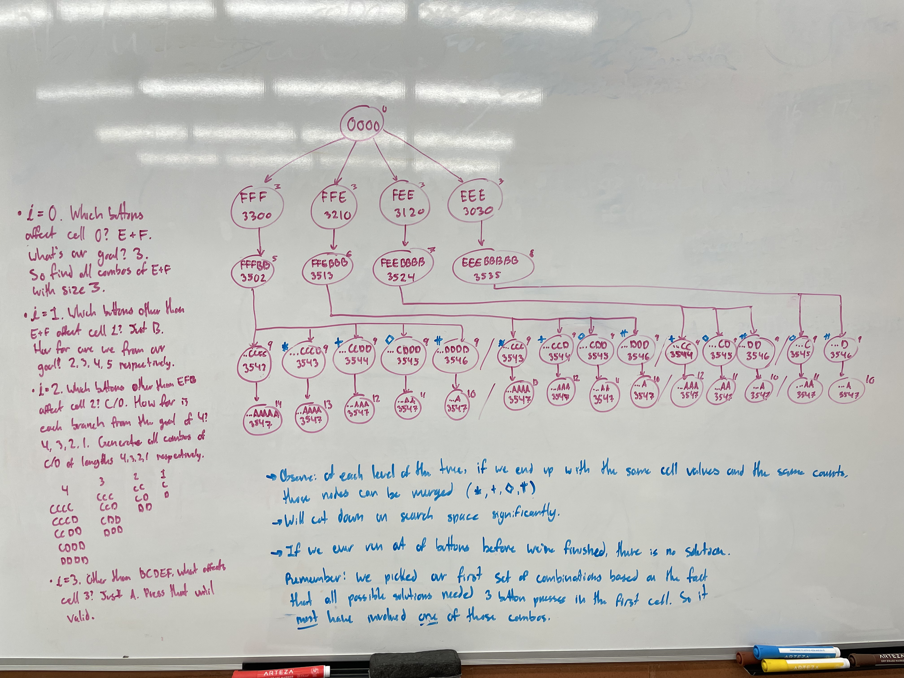
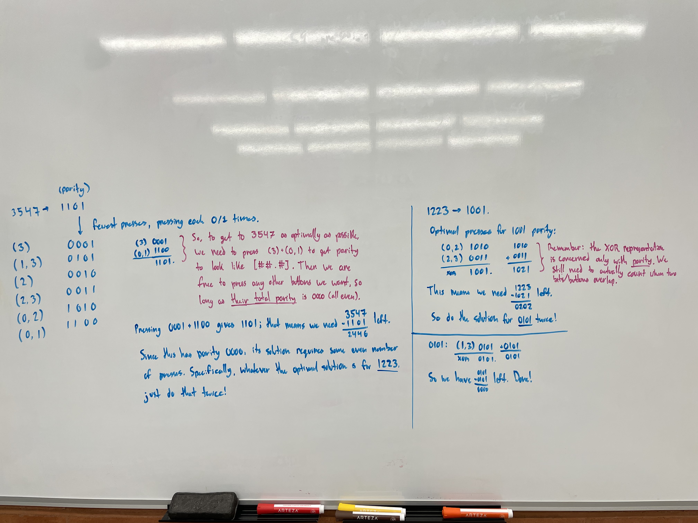
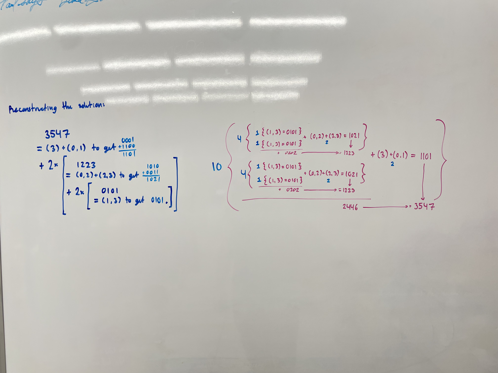

# 2025 day 10, part 2

Part 2 of this puzzle was a bit of a tricky one. I needed some to do some
serious thinking on the whiteboard in my office to figure it out.

I thought it would be kind of fun to keep my whiteboard diagrams

## Attempt 1

When I first got to part 2, I thought it was probably a linear algebra problem.
Specifically, something to do with systems of equations. Even worse, it was
something I don't (yet) have any experience with, _linear programming!_ And,
apparently, _integer_ linear programming is way harder than regular linear
programming.

However, after a friend of mine suggested he had a solution that didn't use
linear programming, I started tinkering with ideas. Literally, on a whiteboard.
Below are some diagrams of the first algorithm I came up with:

This algorithm worked well for the example input. But, on the real input, the
state tree quickly ballooned out and used up 64+ GB of RAM, even when only
storing two levels of the tree at once.

## Attempt 2

This method is probably the intended solution. I can't take credit for the
approach, which came from a [Reddit post][reddit]. I don't usually read the
subreddit at all, and I try to avoid looking at hints or tips if possible. But,
for day 10 part 2, I was well and truly stuck.

Even with the Reddit post, though, I had to take a second to figure it out.
These diagrams were me working through the process to make it intuitive before
trying to implement it in code.

[reddit]: https://www.reddit.com/r/adventofcode/comments/1pk87hl/2025_day_10_part_2_bifurcate_your_way_to_victory/
